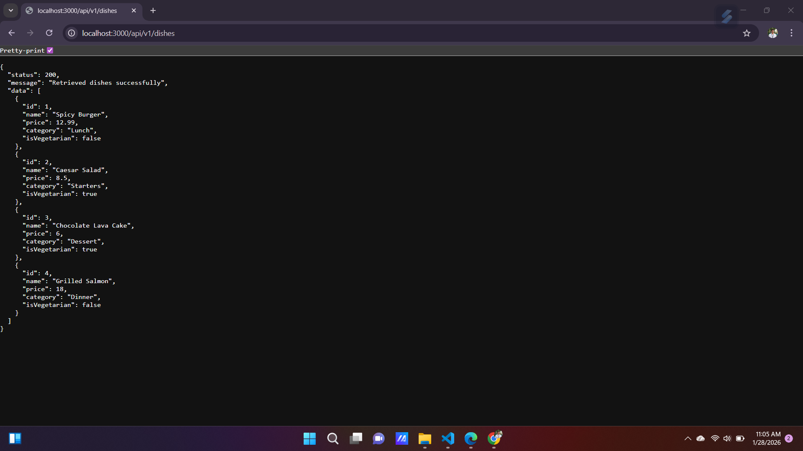

# RESTful API Activity - [Jhon Drhy M. Salangsang]

## Best Practices Implementation

**1. Environment Variables:**
- Why did we put `BASE_URI` in `.env` instead of hardcoding it?
- Answer: Using `.env` for `BASE_URI` makes the application configurable and secure. It allows different environments (development, testing, production) to use different API endpoints without changing the code. It also helps prevent sensitive data from being exposed in the source code.

**2. Resource Modeling:**
- Why did we use plural nouns (e.g., `/dishes`) for our routes?
- Answer: Plural nouns are used in RESTful APIs to represent collections of resources. For example, `/dishes` refers to the collection of all dish objects. This makes the API intuitive and consistent with REST conventions, where `/dishes/1` would refer to a specific dish with ID 1.

**3. Status Codes:**

- When do we use `201 Created` vs `200 OK`?
- Answer: `201 Created` is used when a new resource has been successfully created, typically in response to a POST request. `200 OK` is used when a request is successful but does not result in a new resource being created, such as fetching data with GET or updating with PUT.

- Why is it important to return `404` instead of just an empty array or a generic error?
- Answer: Returning `404 Not Found` clearly communicates that the requested resource does not exist. This prevents confusion with an empty collection (which implies the resource exists but has no items) and provides proper feedback for client applications to handle errors appropriately.

**4. Testing:**
- (Paste a screenshot of a successful GET request here)

Why did I choose to Embed the [Review/Tag/Log]?

 - **Embed:** Reviews are typically small, frequently-read records tied to a single parent (`Dish`). Embedding reviews inside the `Dish` document keeps related data together, simplifies reads (no additional queries), and is efficient for use cases where reviews are only accessed in the context of their dish.

Why did I choose to Reference the [Chef/User/Guest]?

 - **Reference:** Chefs are standalone entities that can be associated with many dishes. Referencing `Chef` from a `Dish` by ObjectId avoids duplication, keeps the chef data normalized, and allows updating chef details in one place without touching all related dishes. It also keeps the Dish document compact while enabling populated joins when needed.